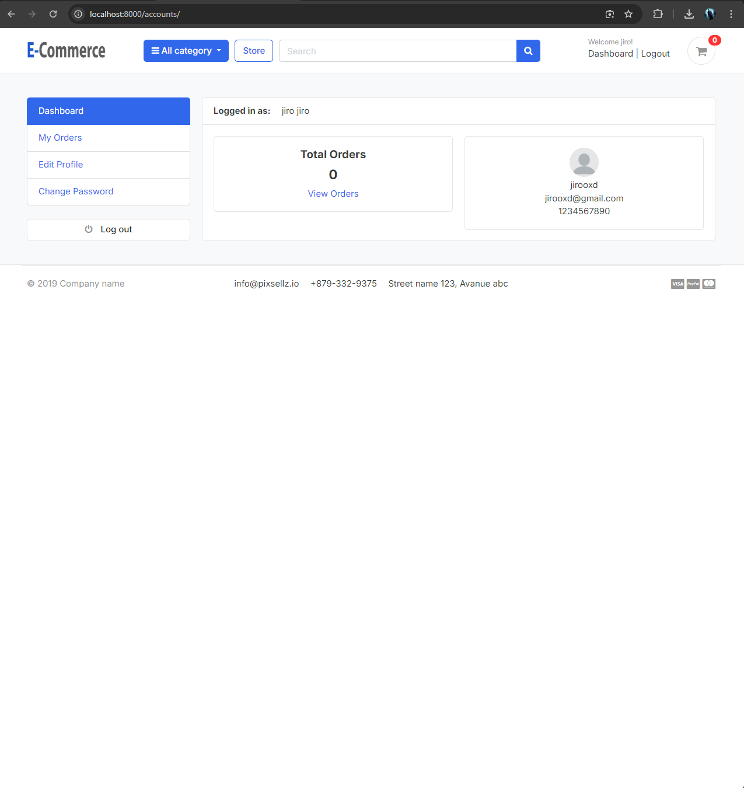
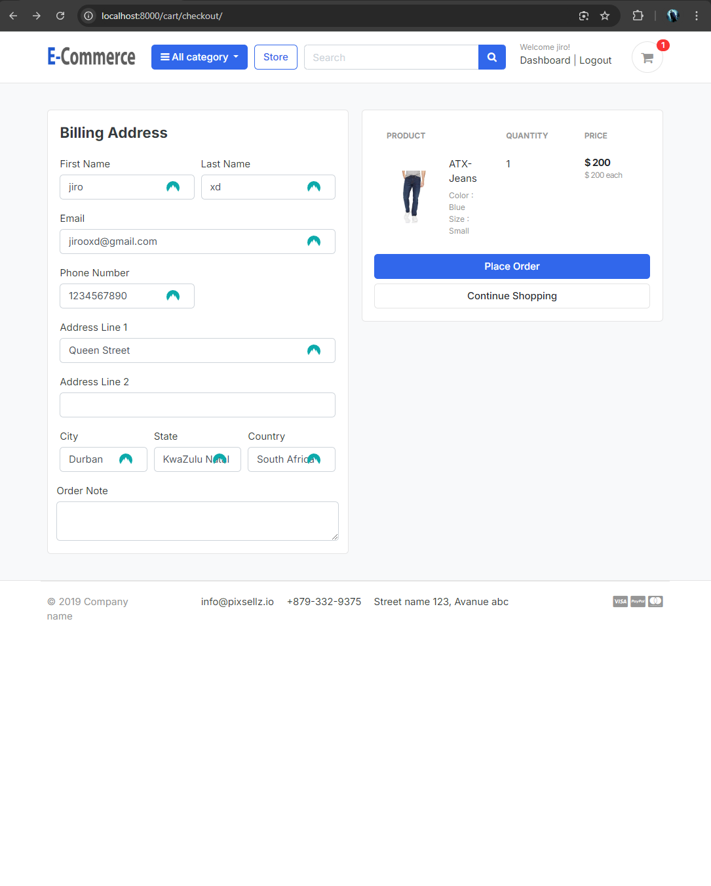

# Django eCommerce Application

This project is a fully functional eCommerce application built using the Django framework. It includes a wide range of features necessary for running an online store, from user authentication and product management to cart functionalities and payment gateway integration.

## Table of Contents

- [Features](#features)
- [Technologies Used](#technologies-used)
- [Getting Started](#getting-started)
- [Installation](#installation)
- [Usage](#usage)
- [Screenshots](#screenshots)

## Features

- Product Management
- Custom User Model, Category & Media Files
- Rating and Review System
- Session Keys, Increment/Decrement/Remove Cart Items
- Context Processors & Product Details
- Cart Functionality
- Context Processor for Cart Item Counter
- Paginator & Search
- Product Variations & Variation Manager
- Adding Variations in Cart, Grouping Cart Item Variations
- Registration, Login with Token-Based Verification & Message Alerts
- User Account Activation & Activation Link Expiry
- Forgot Password with Secure Validation Links
- Cart Checkout, Automatically Assign Cart Items to Logged-in Users
- Orders & Order Number Generation
- Payment Gateway Integration & Place Order
- Post-Order Functionalities
- Review and Rating System with Two Factor Checks
- Rating Average & Review Count Calculation
- My Account Functionalities
- Product Gallery with Unlimited Images
- Django Security Measures

## Technologies Used

- Python
- Django
- HTML/CSS
- JavaScript
- Bootstrap

## Getting Started

These instructions will get you a copy of the project up and running on your local machine for development and testing purposes.

### Prerequisites

- Python 3.x

### Installation Steps

1. **Clone the repository:**

    ```sh
    git clone https://github.com/dev-shahzadali/EcommerceWebsite.git
    ```

2. **Navigate to the project directory:**

    ```sh
    cd EcommerceWebsite
    ```

3. **Create and activate a virtual environment (optional but recommended):**

    ```sh
    python -m venv env
    source env/bin/activate  # On Windows use `env\Scripts\activate`
    ```

4. **Install the required packages:**

    ```sh
    pip install -r requirements.txt
    ```

5. **Set up environment variables:**

    Describe any environment variables that need to be set up. You can create a `.env` file in the root directory and add the environment variables there.

    ```sh
    SECRET_KEY='your_secret_key'
    ```
    To use the contact page email functionality you will need to add gmail account and also get app password from your gmail account and add to .env file. Also change          email address in KAYLAN/kaylan/views.py under contact view function. The email in .env file is used to send the email from and the email in views.py will receive the 
    email from the website.
    
    ```sh
    EMAIL_HOST_USER='gmail'
    EMAIL_HOST_PASSWORD='gmail_app_password'
    ```

6. **Apply the database migrations:**

    ```sh
    python manage.py migrate
    ```

7. **Create a superuser:**

    ```sh
    python manage.py createsuperuser
    ```

8. **Run the development server:**

    ```sh
    python manage.py runserver
    ```


## Screenshots

### Home Page


### Store Page


### Login/Registration


### User Dashboard/Profile



### Cart Page


### Checkout Page



### Place Order & Payment Page


